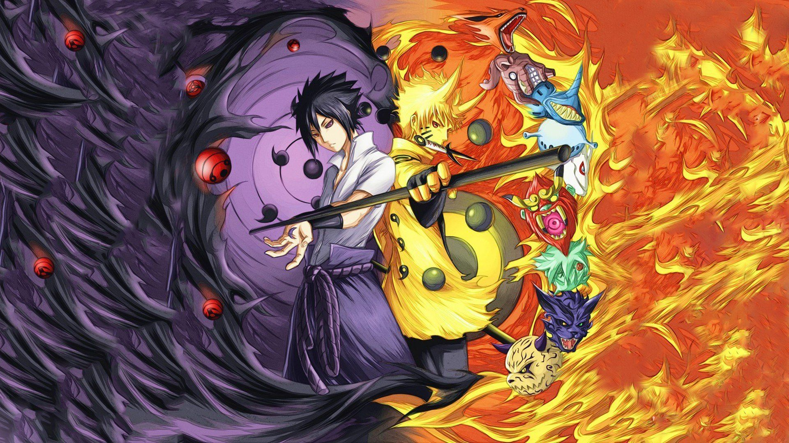

# Narutobox Revised

An extensive custom traits and weapon with anime theme for **Super Worldbox**, now updated to work with game version **0.51.2**.

---

## Overview

**Narutobox Revised Mod** is back, and over 30 unique traits related to Naruto-verse with custom weapons, and special status effects. It introduces new traits ranking that inspired from Naruto!

---

## Features

### Notable Traits

- To be updated...

---

## New Fun Weapons

- **Uchiha Fan**  
  Signature weapons of Uchiha Clan!

- **Executioner Blade**  
  Deadly weapon with slowness ability to slow enemies!

## Installation

**Option 1: Manual**
1. Clone or download this repo as zip.
2. Extract content to the following folder:  
   `...\steamapps\common\worldbox\Mods\NarutoboxRevised`
3. File `Main.cs` must be at `...\steamapps\common\worldbox\Mods\NarutoboxRevised\Main.cs` for the mod to work.

**Option 2: NML One-Click Install**  
Install directly from GameBanana:  
[Narutobox Revised](https://gamebanana.com/mods/435923)

---

## Credits

Special thanks to: 
- The entire **Super Worldbox modding community** for all the support and help in making this mod possible.  
Additional thanks to **Harp**, **Agriche**, and **Ahoyos** for contributions and inspiration.

- The original authors of the mod **thien0012001** and **Astro2Cold** for making such an awsome mods and giving me permission to update this.

---

## License

Feel free to play, modify, or extend this mod. Just give proper credit where it's due. Not for commercial use.